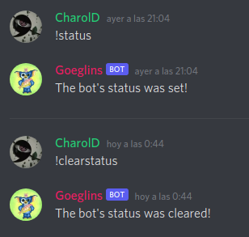
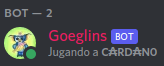
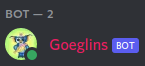
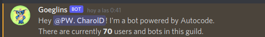
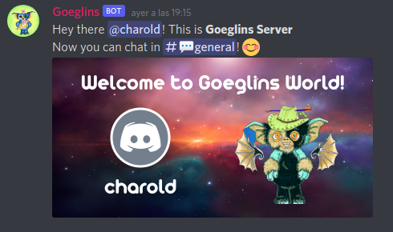

# Goeglin Discord Bot

This is the first version of a Discord Bot for an Nft Project on the Cardano Blockchain. 
Some of goeglins social networks:
- Website: https://goeglins.io/
- Twitter: https://twitter.com/goeglins/
- Discord: https://discord.gg/YbcuA8S9YN

## Endpoints:
### *1. Message Create Handler*

The message creation handler responds to:

**!status** : to change the status of the bot,
**!clearstatus** : to clear the status of the bot.

You can find it under: `functions/events/discord/message/create.js`. 

### *2. Member Count Command*

With the /member-count command, the bot shows the number of users on the server in a message.
Take a look at [Discord slash commands](https://discord.com/developers/docs/interactions/slash-commands) 

You can find it under: `functions/events/discord/command/member-count.js`.

### *3. Welcome image*

This part was developed with a source called [Arista 2.0](https://www.npmjs.com/package/goeglin-font), the use of the [Canvas](https://www.npmjs.com/package/canvas) library for the creation of the welcome image, and some images with the theme of the project. Here a sample:

You can find it under: `functions/events/discord/guild/member/add.js`.

